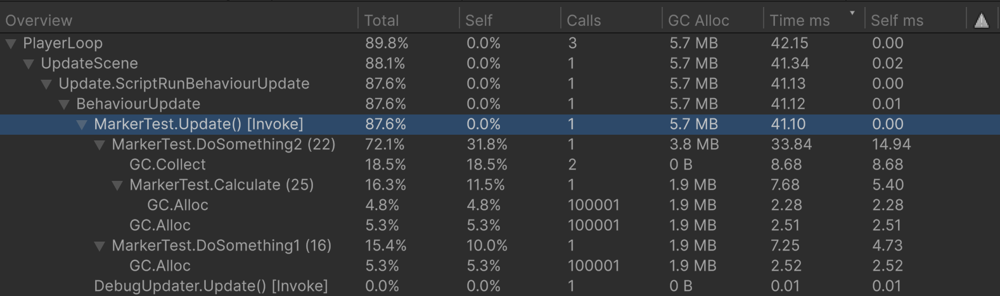
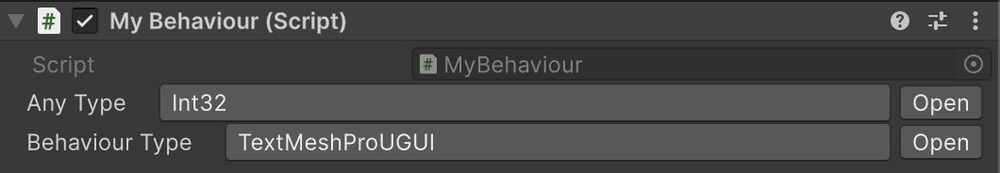
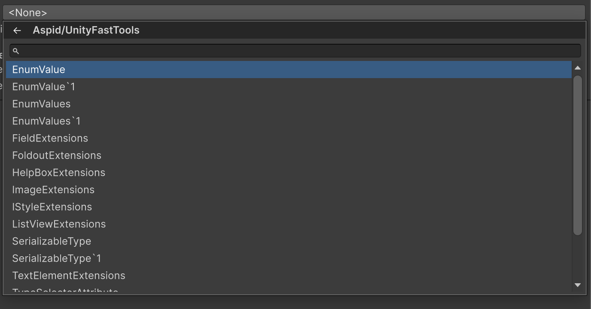
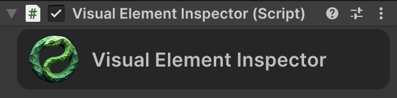

# Aspid.FastTools

**Aspid.FastTools** — набор инструментов, предназначенных для минимизации рутинного написания кода в Unity.

## Исходный код

[[Aspid.FastTools](https://github.com/VPDPersonal/Aspid.FastTools)]


---

## Интеграция

Установите Aspid.FastTools одним из следующих способов:

- **Скачать .unitypackage** — Перейдите на [страницу релизов GitHub](https://github.com/VPDPersonal/Aspid.FastTools/releases) и скачайте последнюю версию `Aspid.FastTools.X.X.X.unitypackage`. Импортируйте его в проект.
- **Через UPM** (Unity Package Manager) подключите следующие пакеты:
  - `https://github.com/VPDPersonal/Aspid.Internal.Unity.git`
  - `https://github.com/VPDPersonal/Aspid.FastTools.git?path=Aspid.FastTools/Assets/Plugins/Aspid/FastTools`

---

## Пространства имён

| Пространство имён | Описание |
|-------------------|----------|
| `Aspid.FastTools` | `IId`, `UniqueIdAttribute`, `StringIdRegistry` |
| `Aspid.FastTools.Types` | `SerializableType`, `SerializableType<T>`, `ComponentTypeSelector`, `TypeSelectorAttribute` |
| `Aspid.FastTools.Enums` | `EnumValues<T>` |
| `Aspid.FastTools.Ids` | `IdRegistry` (int-only во рантайме) |
| `Aspid.FastTools.UIElements` | Runtime fluent-расширения `VisualElement` |
| `Aspid.FastTools.Editors` | Редакторские утилиты — расширения `SerializedProperty`, IMGUI-области, `GetScriptName` |
| `Aspid.FastTools.Types.Editors` · `.Enums.Editors` · `.Ids.Editors` · `.UIElements.Editors` | Редакторский код по фичам (property drawers, инспектор реестров, editor-only расширения `VisualElement`) |

---

## ProfilerMarker

Предоставляет регистрацию `ProfilerMarker` через source generation. Генератор создаёт статический маркер для каждого места вызова, идентифицируемый по вызывающему методу и номеру строки.

```csharp
using UnityEngine;
using Aspid.FastTools;

public class MyBehaviour : MonoBehaviour
{
    private void Update()
    {
        DoSomething1();
        DoSomething2();
    }

    private void DoSomething1()
    {
        using var _ = this.Marker();
        // Некоторый код
    }

    private void DoSomething2()
    {
        using (this.Marker())
        {
            // Некоторый код
            using var _ = this.Marker().WithName("Calculate");
            // Некоторый код
        }
    }
}
```

### Сгенерированный код

```csharp
using System;
using Unity.Profiling;
using System.Runtime.CompilerServices;

internal static class __MyBehaviourProfilerMarkerExtensions
{
    private static readonly ProfilerMarker DoSomething1_line_13 = new("MyBehaviour.DoSomething1 (13)");
    private static readonly ProfilerMarker DoSomething2_line_19 = new("MyBehaviour.DoSomething2 (19)");
    private static readonly ProfilerMarker DoSomething2_line_22 = new("MyBehaviour.Calculate (22)");

    public static ProfilerMarker.AutoScope Marker(this MyBehaviour _, [CallerLineNumberAttribute] int line = -1)
    {
        if (line is 13) return DoSomething1_line_13.Auto();
        if (line is 19) return DoSomething2_line_19.Auto();
        if (line is 22) return DoSomething2_line_22.Auto();

        throw new Exception();
    }
}
```

### Результат



---

## Система сериализуемых типов

Позволяет сериализовать ссылку на `System.Type` в Unity Inspector. Выбранный тип хранится как assembly-qualified name и разрешается лениво при первом обращении.

### SerializableType

Доступны два варианта:

- **`SerializableType`** — хранит любой тип (базовый тип — `object`)
- **`SerializableType<T>`** — хранит тип, ограниченный `T` или его подклассами

Оба поддерживают неявное преобразование в `System.Type`.

```csharp
using UnityEngine;
using Aspid.FastTools.Types;

public class MyBehaviour : MonoBehaviour
{
    [SerializeField] private SerializableType _anyType;
    [SerializeField] private SerializableType<MonoBehaviour> _behaviourType;

    private void Start()
    {
        Type type1 = _anyType;             // неявный оператор
        Type type2 = _behaviourType.Type;  // явное свойство

        var instance = (MonoBehaviour)gameObject.AddComponent(type2);
    }
}
```

### ComponentTypeSelector

Сериализуемая структура, добавляющая в Inspector выпадающий список для смены типа объекта. Добавьте её как поле в базовый класс — при выборе подтипа редактор перезаписывает `m_Script` на `SerializedObject`, фактически превращая компонент или ScriptableObject в выбранный подтип.

Список автоматически ограничивается подтипами класса, в котором объявлено поле. Дополнительная настройка не требуется.

```csharp
using UnityEngine;
using Aspid.FastTools.Types;

public abstract class BaseEnemy : MonoBehaviour
{
    [SerializeField] private ComponentTypeSelector _typeSelector;
}

public class FastEnemy : BaseEnemy { }
public class TankEnemy : BaseEnemy { }
```

---

### TypeSelectorAttribute

Атрибут `PropertyAttribute`, доступный только в редакторе, ограничивающий всплывающее окно выбора типа конкретными базовыми типами. Применяется к полям `string`, хранящим assembly-qualified имена типов.

```csharp
[Conditional("UNITY_EDITOR")]
public sealed class TypeSelectorAttribute : PropertyAttribute
{
    public TypeSelectorAttribute() // базовый тип: object
    public TypeSelectorAttribute(Type type)
    public TypeSelectorAttribute(params Type[] types)
    public TypeSelectorAttribute(string assemblyQualifiedName)
    public TypeSelectorAttribute(params string[] assemblyQualifiedNames)

    public bool AllowAbstractTypes { get; set; } // по умолчанию: false
    public bool AllowInterfaces    { get; set; } // по умолчанию: false
}
```

| Свойство | Описание |
|----------|----------|
| `AllowAbstractTypes` | Включает абстрактные классы в список выбора. По умолчанию: `false` |
| `AllowInterfaces` | Включает интерфейсы в список выбора. По умолчанию: `false` |

```csharp
using UnityEngine;
using Aspid.FastTools.Types;

public class MyBehaviour : MonoBehaviour
{
    [TypeSelector(typeof(IMyInterface))]
    [SerializeField] private string _typeName;

    // Включить абстрактные типы и интерфейсы в список выбора
    [TypeSelector(typeof(object), AllowAbstractTypes = true, AllowInterfaces = true)]
    [SerializeField] private string _anyType;
}
```

### Окно выбора типа

В Inspector отображается кнопка, открывающая всплывающее окно с поиском, которое включает:

- Иерархическую организацию по пространствам имён
- Текстовый поиск с фильтрацией
- Навигацию с клавиатуры (стрелки, Enter, Escape)
- Историю навигации (кнопка «назад»)
- Разрешение неоднозначности для типов с одинаковыми именами из разных сборок


---

## Система перечислений

Предоставляет сериализуемые отображения enum → значение, настраиваемые через Inspector.

### EnumValues\<TValue\>

Сериализуемая коллекция записей `EnumValue<TValue>` с настраиваемым значением по умолчанию. Реализует `IEnumerable<KeyValuePair<Enum, TValue>>`.

```csharp
[Serializable]
public sealed class EnumValues<TValue> : IEnumerable<KeyValuePair<Enum, TValue>>
```

| Член | Описание |
|------|----------|
| `TValue GetValue(Enum enumValue)` | Возвращает сопоставленное значение или `_defaultValue`, если не найдено |
| `bool Equals(Enum, Enum)` | Проверка равенства с поддержкой `[Flags]` |

Поддерживает `[Flags]`-перечисления: `Equals` использует `HasFlag` и корректно обрабатывает члены со значением `0`.

```csharp
using UnityEngine;
using Aspid.FastTools.Enums;

public enum Direction { Left, Right, Up, Down }

public class MyBehaviour : MonoBehaviour
{
    [SerializeField] private EnumValues<Sprite> _directionSprites;

    private void SetIcon(Direction dir)
    {
        var sprite = _directionSprites.GetValue(dir);
        _image.sprite = sprite;
    }
}
```

В Inspector выберите тип перечисления в заголовке `EnumValues`, затем назначьте значение для каждого члена перечисления. Нажмите правой кнопкой мыши по свойству, чтобы открыть контекстное меню с пунктом **Populate Missing Enum Members** — он добавит записи для всех отсутствующих членов перечисления, используя текущее Default Value как начальное значение.

---

## Система ID

Сопоставляет имя, назначаемое в активе, со стабильным целочисленным ID. Получившийся `int` подходит для `switch` и ключей `Dictionary` без затрат на строковые поиски в рантайме.

Доступны два варианта реестра — выбирается по одному на каждый `IId`-struct:

| Реестр | Контракт во рантайме | Когда использовать |
|---|---|---|
| `StringIdRegistry` (`Aspid.FastTools`) | Полное отображение `int ↔ string` доступно во рантайме | Нужны поиски по имени в player-сборках (логи, сейвы, дебаг) |
| `IdRegistry` (`Aspid.FastTools.Ids`) | Во рантайме только int; имена хранятся в editor-only partial и вырезаются из player-сборок | Имена нужны только в редакторе |

Каждый `IId`-struct привязан ровно к одному реестру любого вида — уникальность гарантируется во время поиска через `IdRegistryResolver`, который ищет в обоих видах реестров.

### Использование

**1.** Объявите `partial struct`, реализующий `IId`. Генератор исходников автоматически добавит необходимые поля и свойство:

```csharp
using Aspid.FastTools;

public partial struct EnemyId : IId { }
```

Сгенерированный код:

```csharp
public partial struct EnemyId
{
    [SerializeField] private string __stringId; // editor-only поле, вырезается из player-сборок
    [SerializeField] private int _id;

    public int Id => _id;
}
```

**2.** Создайте ассет реестра и привяжите его к вашему типу структуры в Inspector:
- `Assets → Create → Aspid → FastTools → String Id Registry` — для `StringIdRegistry`;
- `Assets → Create → Aspid → FastTools → Id Registry` — для int-only `IdRegistry`.

**3.** Используйте структуру как сериализуемое поле. В Inspector отображается выпадающий список зарегистрированных имён с кнопкой **Create** для добавления новых записей прямо там:

```csharp
using UnityEngine;
using Aspid.FastTools;

[CreateAssetMenu]
public class EnemyDefinition : ScriptableObject
{
    [UniqueId] [SerializeField] private EnemyId _id;
}
```

```csharp
using UnityEngine;
using Aspid.FastTools;

public class EnemySpawner : MonoBehaviour
{
    [SerializeField] private EnemyId _targetEnemy;

    private void Spawn()
    {
        int id = _targetEnemy.Id; // стабильный integer, безопасен для switch / Dictionary
    }
}
```

### UniqueIdAttribute

Помечает поле как требующее уникального значения среди всех ассетов объявляющего типа. Inspector показывает предупреждение, если два ассета используют одинаковый ID.

```csharp
[Conditional("UNITY_EDITOR")]
public sealed class UniqueIdAttribute : PropertyAttribute { }
```

### StringIdRegistry

`ScriptableObject` из `Aspid.FastTools`, хранящий записи `(int, string)` и поддерживающий таблицы поиска доступными во рантайме. Каждому имени назначается стабильный, автоинкрементный ID, который не изменяется даже при добавлении или удалении других записей.

| Член | Описание |
|------|----------|
| `int GetId(string name)` | Возвращает ID для имени или `-1`, если не найдено |
| `string? GetNameId(int id)` | Возвращает имя для ID или `null`, если не найдено |
| `bool Contains(int id)` | Зарегистрирован ли ID |
| `bool Contains(string name)` | Зарегистрировано ли имя |
| `IEnumerable<int> Ids` · `IEnumerable<string> IdNames` | Перечисление зарегистрированных ID / имён |
| `IEnumerator<KeyValuePair<int, string>> GetEnumerator()` | Итерация по парам `(id, name)` |

### IdRegistry

`ScriptableObject` из `Aspid.FastTools.Ids`, хранящий во рантайме только целочисленные ID — имена существуют как метаданные редактора и вырезаются из player-сборок.

| Член | Описание |
|------|----------|
| `int Count` | Количество зарегистрированных ID |
| `bool Contains(int id)` | Зарегистрирован ли ID |
| `IEnumerator<int> GetEnumerator()` | Итерация по зарегистрированным ID |

У обоих реестров есть генерик-аналог (`StringIdRegistry<T>` / `IdRegistry<T>` с `T : struct, IId`), добавляющий типизированную перегрузку `Contains(T)`. Редактирование — добавление, переименование, удаление записей — выполняется через инспектор реестра и `RegistryEditorCore`, а не через публичный runtime API.

---

## Расширения SerializedProperty

Цепочные расширения над `SerializedProperty` для синхронизации владеющего `SerializedObject`, записи типизированных значений и рефлексии над полем-источником.

```csharp
using Aspid.FastTools.Editors;
```

```csharp
property
    .Update()
    .SetVector3(Vector3.up)
    .SetBool(true)
    .ApplyModifiedProperties();
```

Пакет покрывает:

- **Update / Apply** — `Update`, `UpdateIfRequiredOrScript`, `ApplyModifiedProperties`.
- **Типизированные сеттеры** — `SetValue` (обобщённый диспетчер) и `SetXxx` для `int`/`uint`/`long`/`ulong`/`float`/`double`/`bool`/`string`/`Color`/`Gradient`/`Hash128`/`Rect`/`RectInt`/`Bounds`/`BoundsInt`/`Vector2..4` (и `Vector2/3Int`)/`Quaternion`/`AnimationCurve`/`EntityId` (Unity 6.2+). К каждому идёт парный вариант `SetXxxAndApply`.
- **Enum-сеттеры** — `SetEnumFlag` и `SetEnumIndex` (каждый + `AndApply`).
- **Массивы** — `SetArraySize`, `AddArraySize`, `RemoveArraySize` (каждый + `AndApply`).
- **Ссылки** — `SetManagedReference`, `SetObjectReference`, `SetExposedReference`, а также `SetBoxed` (Unity 6+).
- **Рефлексионные хелперы** — `GetPropertyType`, `GetMemberInfo`, `GetClassInstance` для разрешения C#-члена и runtime-экземпляра, стоящих за property.

> Полный справочник по методам: [SerializedPropertyExtensions_RU.md](SerializedPropertyExtensions_RU.md)

---

## IMGUI-области разметки

```csharp
using Aspid.FastTools.Editors;
```

Три `ref struct`-области — `VerticalScope`, `HorizontalScope`, `ScrollViewScope` — оборачивают `EditorGUILayout.Begin*` / `End*`. Каждая предоставляет свойство `Rect` и вызывает соответствующий метод `End*` в `Dispose`:

```csharp
using (VerticalScope.Begin())
{
    EditorGUILayout.LabelField("Item 1");
    EditorGUILayout.LabelField("Item 2");
}

using (HorizontalScope.Begin())
{
    EditorGUILayout.LabelField("Left");
    EditorGUILayout.LabelField("Right");
}

var scrollPos = Vector2.zero;
using (ScrollViewScope.Begin(ref scrollPos))
{
    EditorGUILayout.LabelField("Scrollable content");
}
```

Получить rect области через перегрузку с `out`-параметром:

```csharp
using (VerticalScope.Begin(out var rect, GUI.skin.box))
{
    EditorGUI.DrawRect(rect, new Color(0, 0, 0, 0.1f));
    EditorGUILayout.LabelField("Boxed content");
}
```

Все перегрузки `Begin` соответствуют сигнатурам `EditorGUILayout.Begin*` (опциональные `GUIStyle`, `GUILayoutOption[]`, параметры scroll view и т.д.).

---

## Расширения VisualElement

Fluent-методы расширения для построения UIToolkit-деревьев в коде. Все методы возвращают `T` (сам элемент) для цепочки вызовов.

```csharp
using Aspid.FastTools.UIElements;         // runtime-расширения
using Aspid.FastTools.UIElements.Editors; // editor-only расширения (например, AddOpenScriptCommand)
```

### Краткий справочник

Пакет покрывает:

- **Основные операции с элементом** — имя, видимость, tooltip, user data, picking mode, data source, а также хелперы `AddChild`/`InsertChild`.
- **Фокус** — `SetFocus`, `SetBlur`, `SetTabIndex`, `SetFocusable`.
- **USS** — `AddClass`/`RemoveClass`/`ToggleInClass`/`EnableInClass`, `AddStyleSheets[FromResource]`.
- **Стили** — все свойства `IStyle`: разметка, размер, отступы, шрифт, текст, цвет, рамка, фон, трансформации (вкл. aspect/filter/material с Unity 6.3+), переходы, overflow, slice, cursor.
- **Специализированные элементы** — `TextElement`, `ITextEdition`, `ITextSelection`, `BaseField`, `BaseBoolField` (Toggle), `INotifyValueChanged` (с опциональными типами `Unity.Mathematics`), `IMixedValueSupport`, `Button`, `Slider`/`BaseSlider`, `ProgressBar`, `HelpBox`, `Foldout`, `Image`, `IMGUIContainer`, а также полная поверхность `ListView`/`TreeView`/`MultiColumn*`.
- **Editor-only команды** — `AddOpenScriptCommand`, `BindTo`/`BindPropertyTo`, `Initialize` для `EnumField`/`EnumFlagsField`, подписка на изменения у `PropertyField`.
- **USS custom-style helpers** — `ICustomStyle.TryGetByEnum` для парсинга строковых USS-свойств в enum.

> Полный справочник по методам: [VisualElementExtensions_RU.md](VisualElementExtensions_RU.md)

### Полный пример

```csharp
using UnityEditor;
using UnityEngine;
using Aspid.FastTools.Editors;          // GetScriptName
using Aspid.FastTools.UIElements;       // runtime-расширения VisualElement
using Aspid.FastTools.UIElements.Editors; // AddOpenScriptCommand
using UnityEngine.UIElements;

[CustomEditor(typeof(MyBehaviour))]
public class MyBehaviourEditor : Editor
{
    public override VisualElement CreateInspectorGUI()
    {
        const string iconPath = "Editor/MyIcon";

        var scriptName = target.GetScriptName();
        var dark  = new Color(0.15f, 0.15f, 0.15f);
        var light = new Color(0.75f, 0.75f, 0.75f);

        return new VisualElement()
            .SetName("Header")
            .SetBackgroundColor(dark)
            .SetFlexDirection(FlexDirection.Row)
            .SetPadding(top: 5, bottom: 5, left: 10, right: 10)
            .SetBorderRadius(topLeft: 10, topRight: 10, bottomLeft: 10, bottomRight: 10)
            .AddChild(new Image()
                .SetName("Icon")
                .AddOpenScriptCommand(target)
                .SetImageFromResource(iconPath)
                .SetSize(width: 40, height: 40))
            .AddChild(new Label(scriptName)
                .SetName("Title")
                .SetFlexGrow(1)
                .SetFontSize(16)
                .SetMargin(left: 10)
                .SetColor(light)
                .SetAlignSelf(Align.Center)
                .SetOverflow(Overflow.Hidden)
                .SetWhiteSpace(WhiteSpace.NoWrap)
                .SetTextOverflow(TextOverflow.Ellipsis)
                .SetUnityFontStyleAndWeight(FontStyle.Bold));
    }
}
```

### Результат



---

## Вспомогательные расширения для редактора

Утилитарные методы для получения отображаемых имён объектов Unity в пользовательских редакторах.

```csharp
using Aspid.FastTools.Editors;
```

```csharp
public static string GetScriptName(this Object obj)
```

Возвращает отображаемое имя объекта Unity:
- Если тип имеет `[AddComponentMenu]`, возвращает `ObjectNames.GetInspectorTitle(obj)`
- В противном случае возвращает `ObjectNames.NicifyVariableName(typeName)`

```csharp
public static string GetScriptNameWithIndex(this Component targetComponent)
```

Возвращает отображаемое имя с числовым суффиксом, если на одном GameObject присутствует несколько компонентов одного типа. Например, если прикреплены два компонента `AudioSource`, второй вернёт `"Audio Source (2)"`.

```csharp
[CustomEditor(typeof(MyBehaviour))]
public class MyBehaviourEditor : Editor
{
    public override VisualElement CreateInspectorGUI()
    {
        // "My Behaviour" — или "Custom Name", если присутствует [AddComponentMenu("Custom Name")]
        var name = target.GetScriptName();

        // "My Behaviour (2)" при наличии второго компонента того же типа
        var nameWithIndex = ((Component)target).GetScriptNameWithIndex();

        return new Label(name);
    }
}
```
