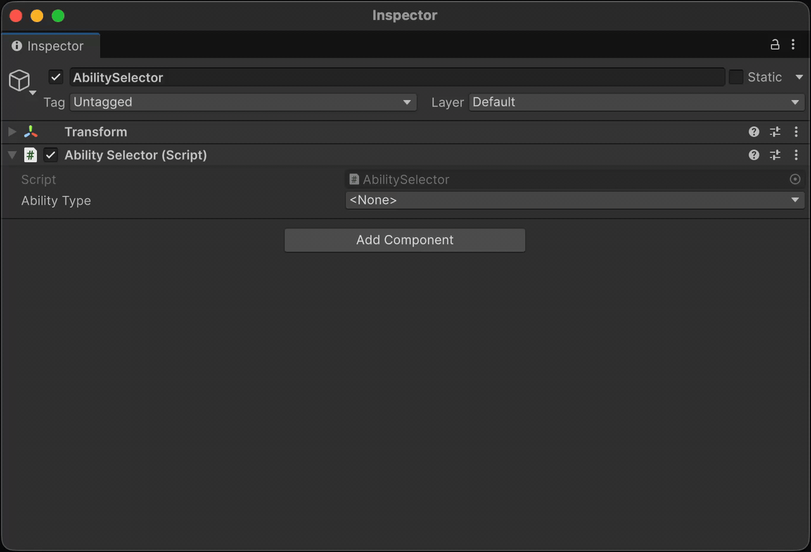
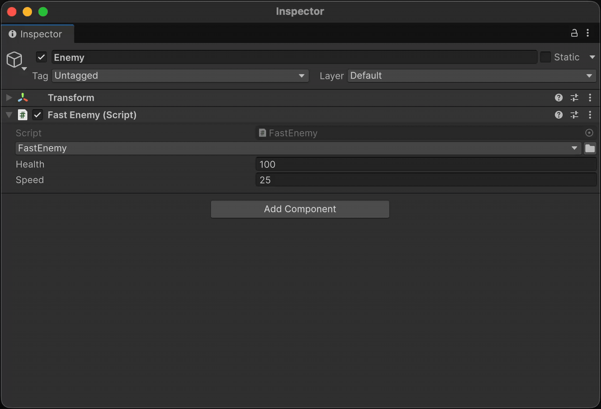
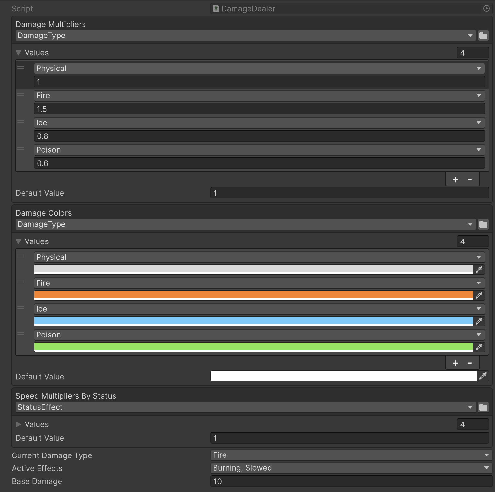
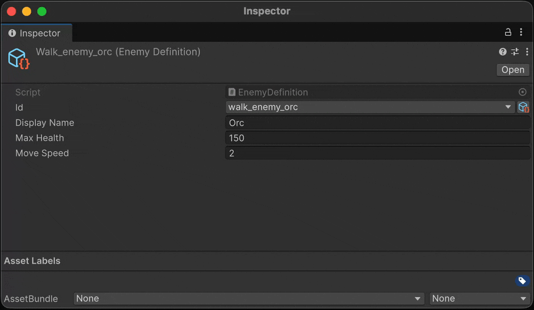
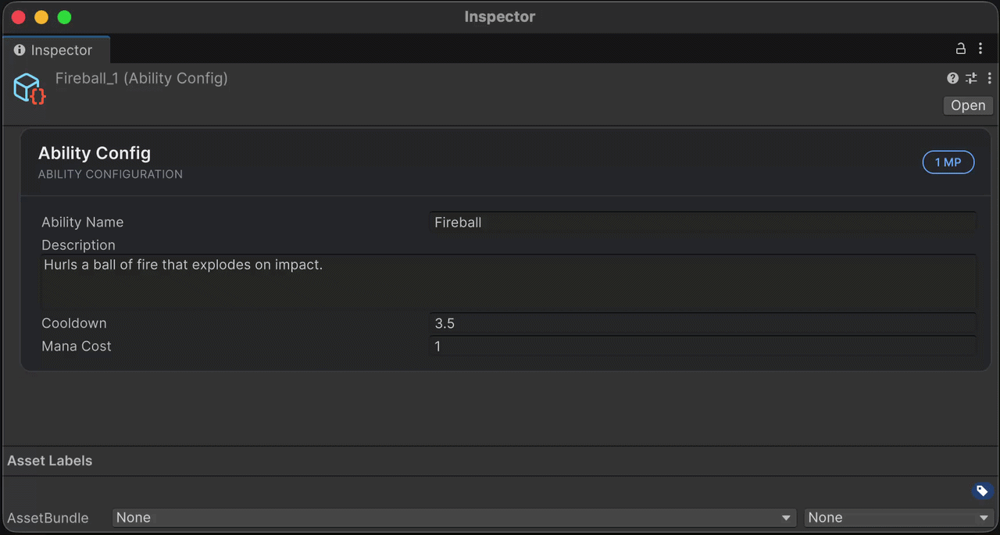

**Aspid.FastTools** is a set of tools designed to minimize routine code writing in Unity. It combines Roslyn-powered source generators with a curated collection of runtime and editor utilities — including per-call-site `ProfilerMarker` registration, a serializable `System.Type`, an `EnumValues<TValue>` dictionary, a stable `int ↔ string` ID registry, fluent UI Toolkit extensions and IMGUI layout scopes.

## Source Code

[[Aspid.FastTools](https://github.com/VPDPersonal/Aspid.FastTools)]

## Table of Contents

- **Getting Started**
  - [Integration](#integration)
  - [Claude Code Plugin](#claude-code-plugin)
  - [Donate](#donate)
- **Features**
  - [ProfilerMarker](#profilermarker)
  - [Serializable Type System](#serializable-type-system)
  - [Enum System](#enum-system)
  - [ID System (Beta)](#id-system-beta)
  - [SerializedProperty Extensions](#serializedproperty-extensions)
  - [IMGUI Layout Scopes](#imgui-layout-scopes)
  - [VisualElement Extensions](#visualelement-extensions)
  - [Editor Helper Extensions](#editor-helper-extensions)

---

## Integration

Install Aspid.FastTools via UPM (Unity Package Manager) — add the package using its Git URL. The release workflow publishes two branches containing only the package contents at their root, so no `?path=` query is needed.

### Stable

The `upm` branch always points to the latest **stable** release:

```
https://github.com/VPDPersonal/Aspid.FastTools.git#upm
```

To install a specific version, target the immutable per-release tag (see [Releases](https://github.com/VPDPersonal/Aspid.FastTools/releases) for the list of available versions):

```
https://github.com/VPDPersonal/Aspid.FastTools.git#upm/1.0.0
```

### Preview

The `upm-preview` branch always points to the latest **preview** release (rc, beta, alpha, …):

```
https://github.com/VPDPersonal/Aspid.FastTools.git#upm-preview
```

To install a specific preview version, target the immutable per-release tag (see [Releases](https://github.com/VPDPersonal/Aspid.FastTools/releases) for the list of available versions):

```
https://github.com/VPDPersonal/Aspid.FastTools.git#upm-preview/1.0.0-rc.2
```

---

## Claude Code Plugin

If you use [Claude Code](https://docs.claude.com/en/docs/claude-code), the companion [Aspid.Claude.Plugins](https://github.com/VPDPersonal/Aspid.Claude.Plugins) marketplace ships the `aspid-fasttools` plugin — a set of skills that teach Claude Code this package's conventions and APIs.

Add the marketplace and install the plugin:

```sh
/plugin marketplace add VPDPersonal/Aspid.Claude.Plugins
/plugin install aspid-fasttools@aspid-claude-plugins
```

Included skills:

- **`aspid-id-struct`** — scaffold a new `IId` struct and `[UniqueId]` fields for the [ID System](#id-system-beta).
- **`aspid-profiler-marker`** — insert `this.Marker()` call sites with the right `using`/scope shape.
- **`aspid-visual-element-fluent`** — build editor or runtime UI using the fluent `VisualElement` extensions.

---

## Donate

This project is developed on a voluntary basis. If you find it useful, you can support its development financially. This helps allocate more time to improving and maintaining **Aspid.FastTools**.

You can donate via the following platforms:
* \[[Unity Asset Store](https://assetstore.unity.com/packages/slug/365584)\]

---

## ProfilerMarker

Provides source-generated `ProfilerMarker` registration. The generator creates a static marker per call-site, identified by the calling method and line number.

```csharp
using UnityEngine;

public class MyBehaviour : MonoBehaviour
{
    private void Update()
    {
        DoSomething1();
        DoSomething2();
    }

    private void DoSomething1()
    {
        using var _ = this.Marker();
        // Some code
    }

    private void DoSomething2()
    {
        using (this.Marker())
        {
            // Some code
            using var _ = this.Marker().WithName("Calculate");
            // Some code
        }
    }
}
```

<details>
<summary><b>Generated code</b></summary>
<br/>

```csharp
using Unity.Profiling;
using System.Runtime.CompilerServices;

internal static class __MyBehaviourProfilerMarkerExtensions
{
    private static readonly ProfilerMarker DoSomething1_Marker_Line_13 = new("MyBehaviour.DoSomething1 (13)");
    private static readonly ProfilerMarker DoSomething2_Marker_Line_19 = new("MyBehaviour.DoSomething2 (19)");
    private static readonly ProfilerMarker DoSomething2_Marker_Line_22 = new("MyBehaviour.Calculate (22)");

    public static ProfilerMarker.AutoScope Marker(this MyBehaviour _, [CallerLineNumberAttribute] int line = -1)
    {
#if ENABLE_PROFILER
        if (line is 13) return DoSomething1_Marker_Line_13.Auto();
        if (line is 19) return DoSomething2_Marker_Line_19.Auto();
        if (line is 22) return DoSomething2_Marker_Line_22.Auto();
#endif
        return default;
    }
}
```

</details>

### Result


---

## Serializable Type System

Allows serializing a `System.Type` reference in the Unity Inspector. The selected type is stored as an assembly-qualified name and resolved lazily on first access.

### SerializableType

Two variants are available:

- **`SerializableType`** — stores any type (base type is `object`)
- **`SerializableType<T>`** — stores a type constrained to `T` or its subclasses

Both support implicit conversion to `System.Type`.

```csharp
using UnityEngine;
using Aspid.FastTools.Types;

public abstract class Ability : MonoBehaviour
{
    public abstract void Activate();
}

public sealed class AbilitySelector : MonoBehaviour
{
    [SerializeField] private SerializableType<Ability> _abilityType;

    private void Start()
    {
        var ability = (Ability)gameObject.AddComponent(_abilityType.Type);
        ability.Activate();
    }
}
```


### TypeSelectorAttribute

An editor-only `PropertyAttribute` that restricts the type selection popup to specific base types. Applied to `string` fields that store assembly-qualified type names.

```csharp
[Conditional("UNITY_EDITOR")]
public sealed class TypeSelectorAttribute : PropertyAttribute
{
    public TypeSelectorAttribute() // base type: object
    public TypeSelectorAttribute(Type type)
    public TypeSelectorAttribute(params Type[] types)
    public TypeSelectorAttribute(string assemblyQualifiedName)
    public TypeSelectorAttribute(params string[] assemblyQualifiedNames)

    public TypeAllow Allow { get; set; } // default: TypeAllow.None
}

[Flags]
public enum TypeAllow
{
    None      = 0,
    Abstract  = 1,
    Interface = 2,
    All       = Abstract | Interface
}
```

| Property | Description |
|----------|-------------|
| `Allow` | Which special type categories (abstract classes, interfaces) the picker includes in addition to plain concrete classes. Default: `TypeAllow.None` |

```csharp
using UnityEngine;
using Aspid.FastTools.Types;

public abstract class AbilityModifier
{
    public abstract void Apply();
}

public sealed class AbilitySelector : MonoBehaviour
{
    // Each element of the array is its own picker constrained to AbilityModifier.
    [TypeSelector(typeof(AbilityModifier))]
    [SerializeField] private string[] _modifierTypes;
}
```

> The complete sample — `Ability` / `AbilitySelector` / `EnemyBase` and their subclasses — ships in the `Types` sample (Package Manager → Aspid.FastTools → Samples).

---

### Type Selector Window

The Inspector shows a button that opens a searchable popup window with:

- Hierarchical namespace organization
- Text search with filtering
- Keyboard navigation (Arrow keys, Enter, Escape)
- Navigation history (back button)
- Assembly disambiguation for types with identical names


The same window is available as a public API — open it from any editor code (custom inspectors, `EditorWindow`, menu items) when you need a type picker outside the standard `SerializableType` / `[TypeSelector]` flow.

```csharp
namespace Aspid.FastTools.Types.Editors
{
    public sealed class TypeSelectorWindow : EditorWindow
    {
        public static void Show(
            Rect screenRect,
            Type[] types = null,
            string currentAqn = "",
            TypeAllow allow = TypeAllow.None,
            Action<string> onSelected = null);
    }
}
```

| Parameter | Description |
|-----------|-------------|
| `screenRect` | Screen-space rectangle the dropdown is anchored to. |
| `types` | Base types used to filter visible items. Only types assignable to **all** entries are listed. Defaults to `typeof(object)`. |
| `currentAqn` | Assembly-qualified name of the currently selected type, used to pre-navigate to its location. Pass `null` or empty to start at the root. |
| `allow` | Which special type kinds (abstract classes, interfaces) are included in addition to concrete classes. Default: `TypeAllow.None`. |
| `onSelected` | Callback invoked with the assembly-qualified name of the selected type, or `null` if the user chose `<None>`. |

### ComponentTypeSelector

A serializable struct that renders a type-switching dropdown in the Inspector. Add it as a field to a base class — picking a subtype rewrites `m_Script` on the `SerializedObject`, effectively changing the component or ScriptableObject to the chosen subtype.

The dropdown is automatically constrained to subtypes of the class that declares the field. No additional configuration is required.

```csharp
using UnityEngine;
using Aspid.FastTools.Types;

public abstract class EnemyBase : MonoBehaviour
{
    [SerializeField] private ComponentTypeSelector _enemyType;
    [SerializeField] [Min(0)] private float _health = 100f;

    public abstract void Attack();
}

public sealed class FastEnemy : EnemyBase
{
    [SerializeField] [Min(0)] private float _speed = 25f;

    public override void Attack() =>
        Debug.Log($"Fast enemy strikes! (speed: {_speed})");
}

public sealed class TankEnemy : EnemyBase
{
    [SerializeField] [Min(0)] private float _armor = 50f;

    public override void Attack() =>
        Debug.Log($"Tank attacks! (armor: {_armor})");
}
```



---

## Enum System

Provides serializable enum-to-value mappings configurable from the Inspector.

### EnumValues\<TValue\>

A serializable collection of `EnumValue<TValue>` entries with a configurable default value. Implements `IEnumerable<KeyValuePair<Enum, TValue>>`.

| Member | Description |
|--------|-------------|
| `TValue GetValue(Enum enumValue)` | Returns the mapped value, or `_defaultValue` if not found |
| `bool Equals(Enum, Enum)` | Equality check with proper `[Flags]` support |

Supports `[Flags]` enums: `Equals` uses `HasFlag` and treats `0`-valued members correctly.

```csharp
using System;
using UnityEngine;
using Aspid.FastTools.Enums;

public enum DamageType { Physical, Fire, Ice, Poison }

[Flags]
public enum StatusEffect
{
    None    = 0,
    Burning = 1,
    Frozen  = 2,
    Slowed  = 4,
    Stunned = 8,
}

public sealed class DamageDealer : MonoBehaviour
{
    [SerializeField] private EnumValues<float> _damageMultipliers;
    [SerializeField] private EnumValues<Color> _damageColors;

    // Flag combinations (e.g. Burning | Slowed) match via HasFlag and first-hit wins,
    // so list composite entries BEFORE their constituent flags.
    [SerializeField] private EnumValues<float> _speedMultipliersByStatus;

    [SerializeField] private DamageType _currentType;
    [SerializeField] private StatusEffect _activeEffects;

    private void DealDamage()
    {
        var multiplier = _damageMultipliers.GetValue(_currentType);
        var color      = _damageColors.GetValue(_currentType);
        var speedMod   = _speedMultipliersByStatus.GetValue(_activeEffects);
        // ...
    }
}
```


In the Inspector, select the enum type in the `EnumValues` header, then assign a value for each enum member. Right-click the property to open a context menu with **Populate Missing Enum Members** — it appends an entry for every enum member not yet in the list, seeded with the current Default Value.

> The complete sample — `DamageDealer` / `DamageType` / `StatusEffect` — ships in the `EnumValues` sample (Package Manager → Aspid.FastTools → Samples).

---

## ID System (Beta)

> **Beta:** the ID System is currently in beta. The public API, generated code layout and editor workflow may change in future releases.

Maps an asset-assignable name to a stable integer ID. Use the resulting `int` in `switch` statements and `Dictionary` keys without paying for string lookups at runtime.

A single `IdRegistry` ScriptableObject maps string names to stable integer IDs and provides full `int ↔ string` lookups at runtime.

### Setup

**1.** Declare a `partial struct` implementing `IId`. The source generator adds the required fields and property automatically:

```csharp
using Aspid.FastTools.Ids;

public partial struct EnemyId : IId { }
```

Generated code:

```csharp
public partial struct EnemyId
{
    [SerializeField] private string __stringId; // editor-only field, stripped from player builds
    [SerializeField] private int _id;

    public int Id => _id;
}
```

The generator reports `AFID001` if the struct is missing `partial`, and `AFID002` if your code already declares `_id`, `Id`, or `__stringId` (the generator skips emission so you get a clear error pointing at the struct rather than a CS compile error inside generated source). Generic targets (`EnemyId<T>`) and generic containing types are supported.

**2.** Create the registry asset and bind it to the struct type in its Inspector:
- `Assets → Create → Aspid → Id Registry`

**3.** Use the struct as a serialized field. The Inspector shows a dropdown of registered names; the selector window also lets you create new entries on the fly:

```csharp
using UnityEngine;
using Aspid.FastTools.Ids;

[CreateAssetMenu]
public class EnemyDefinition : ScriptableObject
{
    [UniqueId] [SerializeField] private EnemyId _id;
}
```

```csharp
using UnityEngine;
using Aspid.FastTools.Ids;

public class EnemySpawner : MonoBehaviour
{
    [SerializeField] private EnemyId _targetEnemy;

    private void Spawn()
    {
        int id = _targetEnemy.Id; // stable integer, safe for switch / Dictionary
    }
}
```


### UniqueIdAttribute

Marks a field as requiring a unique value across all assets of the declaring type. The Inspector shows a warning if two assets share the same ID.

```csharp
[Conditional("UNITY_EDITOR")]
public sealed class UniqueIdAttribute : PropertyAttribute { }
```



### IdRegistry

`ScriptableObject` in `Aspid.FastTools.Ids` that stores `(int, string)` entries and keeps the lookup tables available at runtime. Each name is assigned a stable, auto-incrementing ID that never changes when other entries are added or removed.

| Member | Description |
|--------|-------------|
| `bool TryGetId(string name, out int id)` | Returns `true` and the ID when found; otherwise `false` |
| `bool TryGetName(int id, out string name)` | Returns `true` and the name when found; otherwise `false` and `string.Empty` |
| `bool Contains(int id)` | Whether an ID is registered |
| `bool Contains(string name)` | Whether a name is registered |
| `int Count` | Number of entries |
| `IReadOnlyList<int> Ids` · `IReadOnlyList<string> IdNames` | Registered IDs / names, in registration order |
| `IEnumerator<KeyValuePair<int, string>> GetEnumerator()` | Iterate `(id, name)` pairs |

The registry derives from `ScriptableObject` directly and exposes a generic counterpart `IdRegistry<T>` (with `T : struct, IId`) that adds typed `Contains(T)` and `TryGetName(T, out string)` overloads. Edits — adding, renaming, removing entries — happen through the registry inspector and `RegistryEditorCore`, not via a public runtime API.


---

## SerializedProperty Extensions

Chainable extensions on `SerializedProperty` for synchronizing the owning `SerializedObject`, writing typed values, and reflecting on the underlying field.

```csharp
property
    .Update()
    .SetVector3(Vector3.up)
    .SetBool(true)
    .ApplyModifiedProperties();
```

The package covers:

- **Update / Apply** — `Update`, `UpdateIfRequiredOrScript`, `ApplyModifiedProperties`.
- **Typed setters** — `SetValue` (generic dispatch) and `SetXxx` for `int`/`uint`/`long`/`ulong`/`float`/`double`/`bool`/`string`/`Color`/`Gradient`/`Hash128`/`Rect`/`RectInt`/`Bounds`/`BoundsInt`/`Vector2..4` (and `Vector2/3Int`)/`Quaternion`/`AnimationCurve`/`EntityId` (Unity 6.2+). Each comes with a paired `SetXxxAndApply` variant.
- **Enum setters** — `SetEnumFlag` and `SetEnumIndex` (each + `AndApply`).
- **Arrays** — `SetArraySize`, `AddArraySize`, `RemoveArraySize` (each + `AndApply`).
- **References** — `SetManagedReference`, `SetObjectReference`, `SetExposedReference`, and `SetBoxed` (Unity 6+).
- **Reflection helpers** — `GetPropertyType`, `GetMemberInfo`, `GetClassInstance` for resolving the C# member and runtime instance behind a property.

> Full method-by-method reference: [SerializedPropertyExtensions.md](SerializedPropertyExtensions.md)

---

## IMGUI Layout Scopes

Three `ref struct` scopes — `VerticalScope`, `HorizontalScope`, `ScrollViewScope` — wrap `EditorGUILayout.Begin*` / `End*`. Each exposes a `Rect` property and calls the matching `End*` method on `Dispose`:

```csharp
using (VerticalScope.Begin())
{
    EditorGUILayout.LabelField("Item 1");
    EditorGUILayout.LabelField("Item 2");
}

using (HorizontalScope.Begin())
{
    EditorGUILayout.LabelField("Left");
    EditorGUILayout.LabelField("Right");
}

var scrollPos = Vector2.zero;
using (ScrollViewScope.Begin(ref scrollPos))
{
    EditorGUILayout.LabelField("Scrollable content");
}
```

Capture the group rect with the `out`-overload when needed:

```csharp
using (VerticalScope.Begin(out var rect, GUI.skin.box))
{
    EditorGUI.DrawRect(rect, new Color(0, 0, 0, 0.1f));
    EditorGUILayout.LabelField("Boxed content");
}
```

All `Begin` overloads match the corresponding `EditorGUILayout.Begin*` signatures (optional `GUIStyle`, `GUILayoutOption[]`, scroll view options, etc.).

---

## VisualElement Extensions

Fluent extension methods for building UIToolkit trees in code. All methods return `T` (the element itself) for chaining.

> Full method-by-method reference: [VisualElementExtensions.md](VisualElementExtensions.md)

### Example

A reactive editor for an `AbilityConfig` `ScriptableObject` — title and status pill in the header, `PropertyField` body, and a Warning `HelpBox` that toggles based on `ManaCost`.

```csharp
[CustomEditor(typeof(AbilityConfig))]
internal sealed class AbilityConfigEditor : Editor
{
    public override VisualElement CreateInspectorGUI()
    {
        var config = (AbilityConfig)target;

        var badge = new Label()
            .SetFontSize(10).SetUnityFontStyleAndWeight(FontStyle.Bold)
            .SetPaddingX(10).SetPaddingY(3)
            .SetBorderRadius(10).SetBorderWidth(1);

        var helpBox = new HelpBox(
                "This ability costs no mana — is that intentional?",
                HelpBoxMessageType.Warning)
            .SetMarginTop(8).SetBorderRadius(6);

        var manaField = new PropertyField(serializedObject.FindProperty("_manaCost"))
            .AddValueChanged(_ => Refresh());

        Refresh();
        return new VisualElement()
            .SetBorderRadius(10).SetBorderWidth(1)
            .AddChild(new VisualElement()
                .SetFlexDirection(FlexDirection.Row).SetAlignItems(Align.Center)
                .SetPaddingX(14).SetPaddingY(12)
                .AddChild(new Label(target.GetScriptName())
                    .SetFlexGrow(1).SetFontSize(15)
                    .SetUnityFontStyleAndWeight(FontStyle.Bold))
                .AddChild(badge))
            .AddChild(new VisualElement()
                .SetPaddingX(14).SetPaddingY(12)
                .AddChild(new PropertyField(serializedObject.FindProperty("_abilityName")))
                .AddChild(new PropertyField(serializedObject.FindProperty("_description")))
                .AddChild(new PropertyField(serializedObject.FindProperty("_cooldown")))
                .AddChild(manaField)
                .AddChild(helpBox));

        void Refresh()
        {
            var isFree = config.ManaCost is 0;
            badge.SetText(isFree ? "FREE" : $"{config.ManaCost} MP");
            helpBox.SetDisplay(isFree ? DisplayStyle.Flex : DisplayStyle.None);
        }
    }
}
```

> The complete sample — `AbilityConfig.cs`, the polished `AbilityConfigEditor.cs` (custom colors, subtitle and divider, used in the screenshot below) and two `.asset` examples — ships in the `VisualElements` sample (Package Manager → Aspid.FastTools → Samples).

### Result



---

## Editor Helper Extensions

Utility methods for getting display names of Unity objects in custom editors.

```csharp
public static string GetScriptName(this Object obj)
```

Returns the display name of a Unity object:
- If the type has `[AddComponentMenu]`, returns `ObjectNames.GetInspectorTitle(obj)`
- Otherwise returns `ObjectNames.NicifyVariableName(typeName)`

```csharp
public static string GetScriptNameWithIndex(this Component targetComponent)
```

Returns the display name with a count suffix when multiple components of the same type exist on the same GameObject. For example, if two `AudioSource` components are attached, the second returns `"Audio Source (2)"`.

```csharp
[CustomEditor(typeof(MyBehaviour))]
public class MyBehaviourEditor : Editor
{
    public override VisualElement CreateInspectorGUI()
    {
        // "My Behaviour" — or "Custom Name" if [AddComponentMenu("Custom Name")] is present
        var name = target.GetScriptName();

        // "My Behaviour (2)" when a second component of the same type exists
        var nameWithIndex = ((Component)target).GetScriptNameWithIndex();

        return new Label(name);
    }
}
```
