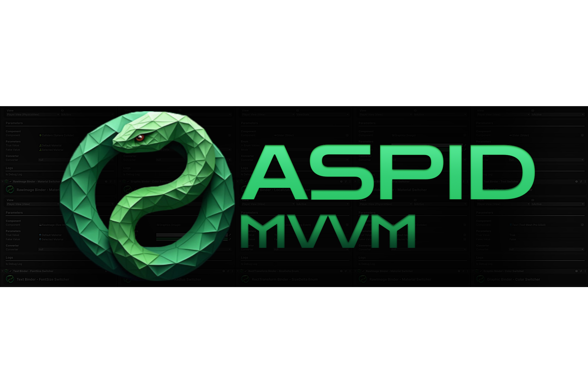

# Introduction
**Aspid.MVVM is a high-performance MVVM framework** based on Source Generator for Unity, 
designed with a focus on simplicity, scalability, and maximum separation of business logic from the view layer.

The framework enables the creation of clean architecture, where the view, logic, and data are clearly separated.
This allows programmers and designers to work in parallel without interfering with each other,
and teams can scale projects without descending into chaos.

## Key Features
### Data Binding
Aspid.MVVM supports four data binding modes between View and ViewModel:
1. OneWay: Automatically updates the View when the ViewModel changes
2. OneTime: Sets the value once during initialization.
3. TwoWay: Synchronizes the View and ViewModel in both directions.
4. OneWayToSource: Updates the ViewModel when the View chang

Each mode can be easily configured using attributes in the code.

### Commands
The framework provides a powerful command mechanism.
1. RelayCommand with five overloads for different numbers of parameters.
2. \[RelayCommand\] attribute for convenient binding of view elements to ViewModel methods.
3. Support for execution conditions (CanExecute).

### Starter Kit
A ready-to-use set of components and templates that helps you quickly start with MVVM architecture in new projects. 
(Depends on Aspid.MVVM and Aspid.Collections.Observable)

### Aspid.Collections.Observable
A set of generic observable collections, including a synchronization mechanism between two observable collections.

### Built-in Integration with DI Frameworks
1. Zenject
2. VContainer

**Integration with DI frameworks is used in the StarterKit.**

### Built-in Integration for SerializeReference Fields Configuration
Currently, converter configuration in the StarterKit works based on the SerializeReferenceDropdown package.

#### Note
There are plans to replace this solution with a built-in one, which is currently under development.

### High Performance
1. No boxing/unboxing during data updates.
2. No reflection during data binding.
3. Optimized for minimal allocations.

### Convenient Debugging
1. Inspect the current state of the ViewModel directly in the Unity Inspector.
2. Modify ViewModel data directly through the Unity Inspector
3. \[BinderLog\] attribute for automatic logging of changes.
4. Clear visual errors in Unity components.

### Extensibility
Aspid.MVVM is designed with extensibility in mind, allowing developers to add their own components (converters, binders, etc.).

### Cross-Platform
The framework supports all platforms on which Unity runs, including mobile devices, PCs, and consoles. 
You can also create different views for different platforms without changing the ViewModel and business logic.

## Who is Aspid.MVVM for?
* Unity Developers who want to:
    * Simplify the maintenance of complex UIs and other views.
    * Improve code structure and avoid “spaghetti code” in large projects.
    * Obtain an architecture that is easy to test and extend.
* Teams aiming to:
    * Organize parallel work of designers and developers.
    * Implement modularity and testing.
    * Create scalable applications.
* Projects where the following are important:
    * Flexibility in changing requirements.
    * Reliable architecture.
    * High performance.

## Aspid.MVVM makes MVVM in Unity not only possible, but also convenient.
