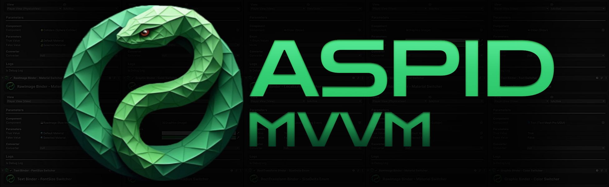

[](https://assetstore.unity.com/packages/slug/298463)
[](https://github.com/VPDPersonal/Aspid.MVVM/releases)
[](https://github.com/VPDPersonal/Aspid.MVVM/releases)
[](LICENSE)

# Introduction
$\color{#6aba7d}\large{\textbf{Aspid.MVVM is a high-performance MVVM framework}}$ for Unity, built on Source Generator, designed 
with a focus on simplicity, scalability, and clear separation of business logic from presentation.

The framework enables a clean architecture where the View, logic, and data are distinctly separated.
This allows programmers and designers to work in parallel without interfering with each other, enabling
teams to scale projects without descending into chaos.

---

### \[[Documentation](https://vpd-inc.gitbook.io/aspid.mvvm/)\] \[[Unity Assets Store](https://assetstore.unity.com/packages/slug/298463)\] \[[Donate](#donate)\] \[[Get Started](#get-started)\]

---

## Source Code
### \[[Aspid.MVVM](https://github.com/VPDPersonal/Aspid.MVVM/tree/main)\] \[[Aspid.MVVM.Generators](https://github.com/VPDPersonal/Aspid.MVVM.Generators)\]
### \[[Aspid.MVVM.Unity.Generators](https://github.com/VPDPersonal/Aspid.MVVM.Unity.Generators)\] \[[Aspid.MVVM.Analyzers](https://github.com/VPDPersonal/Aspid.MVVM.Analyzers)\]

---

## Integration

### Stable (recommended)

The current stable release is the recommended choice for production. Install it either way:

* **Unity Asset Store** — add it to your account from the
  [Asset Store page](https://assetstore.unity.com/packages/slug/298463), then import it through the
  Package Manager (*Window → Package Manager → My Assets*).
* **Releases page** — download the package from the
  [Releases](https://github.com/VPDPersonal/Aspid.MVVM/releases) page and import it into your project.

<details>
<summary><b>🧪 Preview (1.1.0) — install via UPM</b></summary>

<br>

The `1.1.0` line is published as a UPM package on the `upm-preview` branch and is installed through the
Unity Package Manager via Git URLs (*Window → Package Manager → + → Install package from git URL…*).
The release workflow publishes a branch containing only the package contents at its root, so no `?path=`
query is needed.

Its assemblies depend on two external git packages that are **not** resolved automatically. Add the
packages **in this order** so each dependency is present before the package that needs it:

**1. Aspid.FastTools** — preview channel:

```
https://github.com/VPDPersonal/Aspid.FastTools.git#upm-preview
```

**2. Aspid.Collections** — stable channel:

```
https://github.com/VPDPersonal/Aspid.Collections.git#upm
```

**3. Aspid.MVVM** — preview channel:

```
https://github.com/VPDPersonal/Aspid.MVVM.git#upm-preview
```

The `upm-preview` branch always points to the latest **preview** release (beta, rc, …). To pin a specific
preview version, target its immutable per-release tag (see
[Releases](https://github.com/VPDPersonal/Aspid.MVVM/releases) for the list of available versions):

```
https://github.com/VPDPersonal/Aspid.MVVM.git#upm/1.1.0-beta.1
```

</details>

---

## ⚡️Key Features
### Data Binding
* $\color{#6aba7d}\large{\textbf{Aspid.MVVM}}$ supports four primary data binding modes between View and ViewModel:
* $\color{#6aba7d}\large{\textbf{OneWay}}$ – Automatically updates the View when the ViewModel changes.
* $\color{#6aba7d}\large{\textbf{TwoWay}}$ – Bidirectional synchronization between View and ViewModel.
* $\color{#6aba7d}\large{\textbf{OneTime}}$ – Sets the value once during initialization.
* $\color{#6aba7d}\large{\textbf{OneWayToSource}}$ – Updates the ViewModel when the View changes.

Binding modes can be easily specified:
* In the **View**: Directly via the Unity Inspector.
* In the **ViewModel**: Using attributes to restrict allowed binding modes.

$\color{#4fa35d}\large{\textbf{Bindings operate without reflection or boxing/unboxing, ensuring high performance.}}$

### ViewModel
With the built-in Source Generator, you can bind any data type:
* No need to inherit from specialized base classes.
* No wrappers or wrapped properties required.
* No boilerplate code, using attributes for configuration.

### Commands
A power command mechanism:
* Supports up to four parameters — simply select the desired signature.
* The `[RelayCommand]` attribute transforms a regular method into a command with `CanExecute` support.

### Observable Collections
A set of flexible, covariant observable collections:
* `ObservableList<T>`
* `ObservableDictionary<TKey, TValue>`
* `ObservableHasSet<T>`
* `ObservableStack<T>`
* `ObservableQueue<T>`

Features:
* Easy synchronization between two dependent collections.
* Support for filtering and sorting without modifying the source collection.

### StarterKit
A ready-to-use set of components for a quick start:
* $\color{#6aba7d}\large{\textbf{Binders}}$: Quickly connect to the desired component property.
* $\color{#6aba7d}\large{\textbf{Value Converters}}$: Transform values for display without altering the ViewModel.
* $\color{#6aba7d}\large{\textbf{List Components}}$: Including:
  * $\color{#6aba7d}\large{\textbf{Virtualized List}}$: Efficiently handles thousands of elements.
* $\color{#6aba7d}\large{\textbf{Dynamic ViewModel}}$: For simple structured data without writing a specialized ViewModel.
* $\color{#6aba7d}\large{\textbf{View Initialization Components}}$: Initialize Views by ViewModel via the Unity Inspector, with support for popular DI frameworks: Zenject, VContainer.

### Convenient Debugging:
* View and modify ViewModel state directly in the Unity Inspector, even for plain C# classes.
* `[BinderLog]` attribute for automatic logging of value changes.
* Clear visual errors in the editor for incorrect bindings.

### High Performance
$\color{#6aba7d}\large{\textbf{Aspid.MVVM}}$ is designed with performance in mind:
* No reflection in bindings.
* No boxing/unboxing when passing values.
* Minimized memory allocations.

### Extensibility
The framework is easily extensible:
* Create custom binders, converters, components, and more.
* Extend the framework to suit project needs without modifying its core.

### Cross-Platform Support
$\color{#6aba7d}\large{\textbf{Aspid.MVVM}}$ works on all Unity-supported platforms:
* PC, mobile devices, consoles.
* Create different Views for different platforms without changing the ViewModel or business logic.

---

## Who is Aspid.MVVM For?
### $\color{#6aba7d}\large{\textbf{Unity Developers}}$, who want to:
* Simplify maintenance of complex UI and other presentations.
* Improve code structure, avoiding "spaghetti code" in large projects.
* Achieve an architecture suitable for testing and extension.

### $\color{#6aba7d}\large{\textbf{Teams}}$, aiming to:
* Enable parallel work for designers and developers.
* Implement modular development and testing.
* Build scalable applications.

### $\color{#6aba7d}\large{\textbf{Projects}}$, where the following are critical:
* Flexibility in adapting to changing requirements.
* Robust architecture.
* High performance.

---

# Donate
This project is developed on a voluntary basis. If you find it useful, you can support its development financially. This helps allocate more time to improving and maintaining $\color{#6aba7d}\large{\textbf{Aspid.MVVM}}$.

You can donate via the following platforms:
* \[[Unity Asset Store](https://assetstore.unity.com/packages/slug/298463)\]

---

# Get Started
Here are some helpful pages to quickly and easily get started with our product:

* [Integration](https://vpd-inc.gitbook.io/aspid.mvvm/introduction/getting-started/integration)
* [What is MVVM?](https://vpd-inc.gitbook.io/aspid.mvvm/introduction/what-is-mvvm)
* [Getting Started](https://vpd-inc.gitbook.io/aspid.mvvm/introduction/getting-started)
* [Overview - ViewModel](https://vpd-inc.gitbook.io/aspid.mvvm/overview/overview-viewmodel)
* [Overview - Commands](https://vpd-inc.gitbook.io/aspid.mvvm/overview/overview-commands)
* [Overview - Binders](https://vpd-inc.gitbook.io/aspid.mvvm/overview/overview-binders)
* [Overview - View](https://vpd-inc.gitbook.io/aspid.mvvm/overview/overview-view)

---

$\color{#4fa35d}\Huge{\textbf{Aspid.MVVM makes MVVM in Unity not only possible but also convenient.}}$

---
