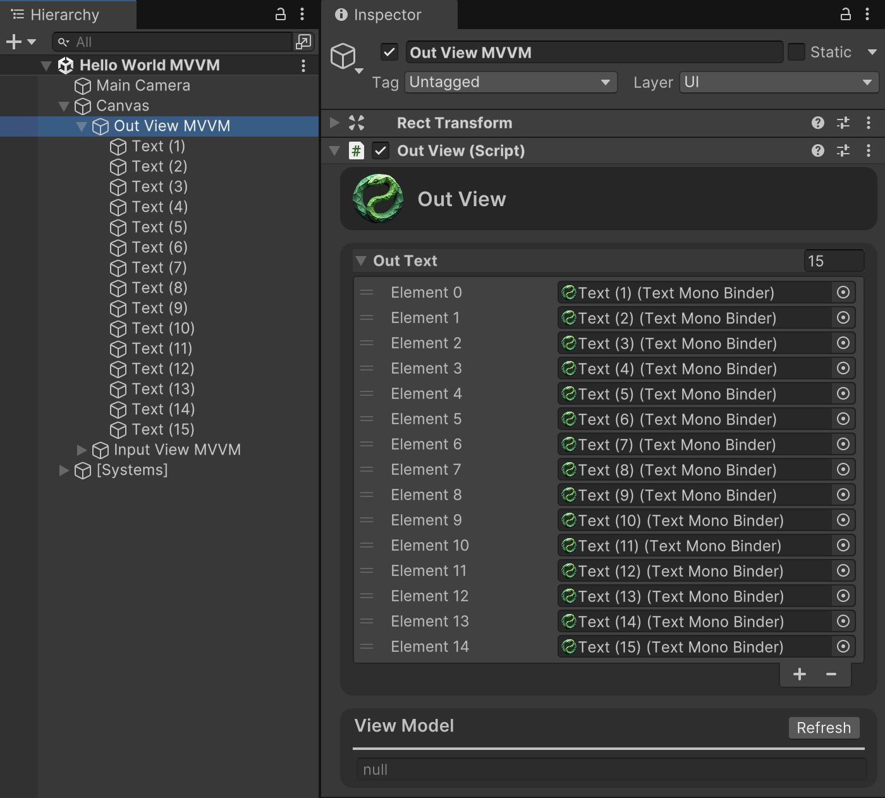

# MVVM

To implement the task using the <mark style="color:$primary;">**MVVM (Model-View-ViewModel)**</mark> approach, we need two Views: one to display the text and another to handle text input. These Views will share a single ViewModel.

<h2 align="center">1. Initial Version</h2>

### 1.1 Create a Scene

Create a new scene and add a [Canvas](https://docs.unity3d.com/Packages/com.unity.ugui@2.0/manual/UICanvas.html), to it. On the Canvas, add an empty GameObject named "Out View MVVM" and attach a [TextMeshProUGUI](https://docs.unity3d.com/Packages/com.unity.textmeshpro@4.0/manual/TMPObjectUIText.html) component to it.

<figure><figcaption></figcaption></figure>

<figure><figcaption></figcaption></figure>

Add an object named "Input View MVVM" to the Canvas.

<figure><figcaption></figcaption></figure>

Inside "Input View MVVM," add two objects: an [InputField](https://docs.unity3d.com/Packages/com.unity.textmeshpro@4.0/api/TMPro.TMP_InputField.html) and a [Button](https://docs.unity3d.com/Packages/com.unity.ugui@3.0/manual/script-Button.html)

<figure><figcaption></figcaption></figure>

<figure><figcaption></figcaption></figure>

<figure><figcaption></figcaption></figure>

### 1.2. Create OutView

Create a View to handle displaying text on the screen:


```csharp
using Aspid.MVVM;
using UnityEngine;

// Each View is marked with the [View] attribute
// and must be partial for proper code generation.
// Typically, it inherits from MonoView, a MonoBehaviour descendant,
// for compatibility with MonoBinder.
[View]
public sealed partial class OutView : MonoView
{
    // [RequireBinder] is an optional attribute that restricts
    // the allowed binders by data type (in this case, string).
    // The field name must match the corresponding field in the ViewModel.
    // The field names _outText, m_outText, s_outText, and outText are equivalent.
    // MonoBinder is the base class for all binders that are MonoBehaviours..
    [RequireBinder(typeof(string))]
    [SerializeField] private MonoBinder[] _outText;
}
```


For more details on how Views work, see the [Overview - view](../../overview/overview-view.md) or [View](../../documentation/view/) sections.

### 1.3. Configure OutView

Add the <mark style="color:$warning;">`OutView`</mark> component to the "Out View MVVM" GameObject.

<figure><figcaption></figcaption></figure>

On the GameObject with the <mark style="color:$warning;">`TextMeshProUGUI`</mark> component, add a text binder: <mark style="color:$warning;">`Text Binder - Text`</mark> from the <mark style="color:$warning;">`StarterKit`</mark> via the component's context menu or any other method.

<figure><figcaption></figcaption></figure>

The component will appear red, indicating that the binder is not yet attached. In the Inspector, select the View dropdown and choose "<mark style="color:$primary;">**Out View MVVM (OutView)**</mark>", then set the Id to "<mark style="color:$primary;">**OutText**</mark>".

<figure><figcaption></figcaption></figure>

A valid binder will look like this:

<figure><figcaption></figcaption></figure>

Notice how the View changes after the binder is set:

<figure><figcaption></figcaption></figure>

### 1.4. Create InputView

Create a View to handle processing the entered text:

```csharp
using Aspid.MVVM;
using UnityEngine;

[View]
public sealed partial class InputView : MonoView
{
    // _inputText can accept only one binder.
    // This approach is convenient when we know there will be exactly one binding element.
    [RequireBinder(typeof(string))]
    [SerializeField] private MonoBinder _inputText;
        
    // _sayCommand is declared as an array, which is convenient
    // as it allows attaching an unlimited number of binding elements.
    [RequireBinder(typeof(IRelayCommand))]
    [SerializeField] private MonoBinder[] _sayCommand;
}
```

For more details on working with commands, see the [Overview - Commands](../../overview/overview-commands.md) or [Commands](../../documentation/commands/) sections.

### 1.5. Configure InputView

Add the <mark style="color:$warning;">`InputView`</mark> component to the "Input View MVVM" GameObject.

<figure><figcaption></figcaption></figure>

On the GameObject with the <mark style="color:$warning;">`TextMeshPro - InputField`</mark>, add two binders from the <mark style="color:$warning;">`StarterKit`</mark>:

* <mark style="color:$warning;">`InputField Binder - Command`</mark> (for sending text via the <mark style="color:$warning;">`InputField`</mark> Submit action).
* <mark style="color:$warning;">`InputField Binder - Text`</mark> (for setting the entered text in the ViewModel).

Add these binders via the component’s context menu or any other method.

<figure><figcaption></figcaption></figure>

Configure the binders in the Inspector.

<figure><figcaption></figcaption></figure>

On the GameObject with the <mark style="color:$warning;">`Button`</mark>, add the <mark style="color:$warning;">`Button Binder - Command`</mark> from the <mark style="color:$warning;">`StarterKit`</mark> via the component’s context menu or any other method and configure it.

<figure><figcaption></figcaption></figure>

Notice how the View changes after setting the binders:

<figure><figcaption></figcaption></figure>

### 1.6. Create SpeakerViewModel

Now we need to link our View to our model. Unlike the MVP approach, here we can use the same ViewModel for different Views.


```csharp
using System;
using Aspid.MVVM;

// Explanation:
// 1. The _outText field uses OneWay binding to retrieve the value from the model.
// 2. The _inputText field uses TwoWay binding to set the initial value
//    and retrieve the updated value from the View.
// 3. The Say command uses OneTime binding and is executed from the View.

// Each ViewModel is marked with the [ViewModel] attribute
// and must be partial for proper code generation.
[ViewModel]
public sealed partial class SpeakerViewModel : IDisposable
{ 
    // [OneWayBind] is a marker for the Source Generator,
    // which creates a OneWay binding.
    // The Source Generator generates a property "OutText",
    // a method "SetOutText", and an event "OutTextChanged" for binding.
    // The Source Generator correctly handles the following naming styles:
    // s_outText, m_outText, _outText, outText.
    // The class must be marked with the [ViewModel] attribute
    // for the Source Generator to work.
    [OneWayBind] private string _outText;
        
    // [TwoWayBind] is a marker for the Source Generator,
    // which creates a TwoWay binding.
    // The Source Generator generates a property "InputText",
    // a method "SetInputText", and an event "InputTextChanged" for binding.
    // The Source Generator correctly handles the following naming styles:
    // s_inputText, m_inputText, _inputText, inputText.
    // The class must be marked with the [ViewModel] attribute
    // for the Source Generator to work.
    [TwoWayBind] private string _inputText;
        
    private readonly Speaker _speaker;
    
    public SpeakerViewModel(Speaker speaker)
    {
        _speaker = speaker;
        _outText = speaker.Text;
        _inputText = speaker.Text;
            
        // Add a handler for the TextChanged event
        // generated by the Source Generator.
        _speaker.TextChanged += SetOutText;
    }
    
    // [RelayCommand] is a marker for the Source Generator.
    // The Source Generator creates a read-only property "SayCommand"
    // based on this method.
    // The "SayCommand" property supports only OneTime and OneWay binding
    // on the View side since it is read-only.
    // The class must be marked with the [ViewModel] attribute
    // for the Source Generator to work.
    [RelayCommand]
    private void Say()
    {
        // Although not required, it is recommended to read the value
        // through the generated property.
        // A code analyzer will issue a warning if _inputText is used directly.
        _speaker.Say(InputText);
    }

    public void Dispose() =>
        _speaker.TextChanged -= SetOutText;
}
```


For more details on working with ViewModels, see the [Overview - ViewModel](../../overview/overview-viewmodel.md) or [ViewModel](../../documentation/viewmodel/) sections.

For more details on working with commands, see the [Overview - Commands](../../overview/overview-commands.md) or [Commands](../../documentation/commands/) sections.

### 1.7. Создайте Bootstrap

Now, connect the three components (Model, View, ViewModel):


```csharp
using System;
using UnityEngine;

public sealed class Bootstrap : MonoBehaviour
{
    [Header("Views")]
    [SerializeField] private OutView _outView;
    [SerializeField] private InputView _inputView;
        
    private Speaker _speaker;

    private void Awake()
    {
        _speaker = new Speaker();
        InitializeViews();
    }

    private void OnDestroy() => 
        DeinitializeViews();

    private void InitializeViews()
    {
        var viewModel = new SpeakerViewModel(_speaker)
            
        _outView.Initialize(viewModel);
        _inputView.Initialize(viewModel);
    }
        
    private void DeinitializeViews()
    {
        // You can use extension methods to deinitialize the View
        // and dispose of the ViewModel.
        _outView.DeinitializeView()?.DisposeViewModel();
        _inputView.DeinitializeView()?.DisposeViewModel();
            
        // Manual way to deinitialize the View and dispose of the ViewModel:
        // var viewModel = _outView.ViewModel;
        // _outView.Deinitialize();
        //
        // if (viewModel is IDisposable disposable) 
        //     disposable.Dispose();
    }
}
```


In this case, we can pass the same ViewModel instance to each View, but you can also pass a unique ViewModel instance to each View.

### 1.8. Configure Bootstrap

Create an empty GameObject in the scene, add the <mark style="color:$warning;">`Bootstrap`</mark> component to it, and assign all references in the Inspector.

<figure><figcaption></figcaption></figure>

### 1.9. Run and Test



## Enter text and press Enter or click the "Say" button to verify the implementation.

<figure><figcaption></figcaption></figure>



## Model

```csharp
using System;

public class Speaker
{
    public event Action<string> TextChanged;
    
    private string _text;
    
    public string Text
    {
        get => _text;
        private set
        {
            _text = value;
            TextChanged?.Invoke();
        }
    }
    
    public void Say(string text) =>
        Text = text;
}
```

## OutView

```csharp
using Aspid.MVVM;
using UnityEngine;

[View]
public sealed partial class OutView : MonoView
{
    [RequireBinder(typeof(string))]
    [SerializeField] private MonoBinder[] _outText;
}
```

## InputView

```csharp
using Aspid.MVVM;
using UnityEngine;

[View]
public sealed partial class InputView : MonoView
{
    [RequireBinder(typeof(string))]
    [SerializeField] private MonoBinder _inputText;
        
    [RequireBinder(typeof(IRelayCommand))]
    [SerializeField] private MonoBinder[] _sayCommand;
}
```

## SpeakerViewModel

```csharp
using System;
using Aspid.MVVM;

[ViewModel]
public sealed partial class SpeakerViewModel : IDisposable
{ 
    [OneWayBind] private string _outText;
    [TwoWayBind] private string _inputText;
        
    private readonly Speaker _speaker;
    
    public SpeakerViewModel(Speaker speaker)
    {
        _speaker = speaker;
        _outText = speaker.Text;
        _inputText = speaker.Text;

        _speaker.TextChanged += SetOutText;
    }

    [RelayCommand]
    private void Say() =>
        _speaker.Say(InputText);

    public void Dispose() =>
        _speaker.TextChanged -= SetOutText;
}
```

## Bootstrap

```csharp
using System;
using UnityEngine;

public sealed class Bootstrap : MonoBehaviour
{
    [Header("Views")]
    [SerializeField] private OutView _outView;
    [SerializeField] private InputView _inputView;
        
    private Speaker _speaker;

    private void Awake()
    {
        _speaker = new Speaker();
        InitializeViews();
    }

    private void OnDestroy() => 
        DeinitializeViews();

    private void InitializeViews()
    {
        var viewModel = new SpeakerViewModel(_speaker)
            
        _outView.Initialize(viewModel);
        _inputView.Initialize(viewModel);
    }
        
    private void DeinitializeViews()
    {
        _outView.DeinitializeView()?.DisposeViewModel();
        _inputView.DeinitializeView()?.DisposeViewModel();
    }
}
```



<figure><figcaption></figcaption></figure>

<figure><figcaption></figcaption></figure>

<figure><figcaption></figcaption></figure>



<h2 align="center">2. New Requirements</h2>

The task was completed, but the requirements have changed slightly. Now, the text must be displayed in multiple text elements instead of a single one. With MVVM, we don’t need to modify any code; we only need to add new text elements with binders to <mark style="color:$warning;">`OutView`</mark>.

Additionally, there’s a new requirement to display the text instantly as it changes in the <mark style="color:$warning;">`InputField`</mark>. This requires new behavior and a new ViewModel.

### 2.1  Создайте MomentSpeakerViewModel


```csharp
using System;
using Aspid.MVVM;

// Explanation:
// 1. The _outText field uses OneWay binding to retrieve the value from the model.
// 2. The _inputText field uses TwoWay binding to set the initial value
//    and retrieve the updated value from the View.
// 3. When InputText changes, we immediately pass it to the model
//    via the OnInputTextChanged method.
[ViewModel]
public sealed partial class MomentSpeakerViewModel : IDisposable
{
    [OneWayBind] private string _outText;
    [TwoWayBind] private string _inputText;
    
    private readonly Speaker _speaker;
    
    public MomentSpeakerViewModel(Speaker speaker)
    {
        _speaker = speaker;
        _outText = speaker.Text;
        _inputText = speaker.Text;
            
        // Add a handler for the TextChanged event
        // generated by the Source Generator.
        _speaker.TextChanged += SetOutText;
    }
        
    // For each generated bound property, you can implement
    // two partial methods:
    // Called before the change:
    // partial void On{PropertyName}Changing(string oldValue, string newValue)
    // Called after the change:
    // partial void On{PropertyName}Changed(string newValue)
    partial void OnInputTextChanged(string newValue) =>
        _speaker.Say(newValue);
        
    public void Dispose() =>
        _speaker.TextChanged -= SetOutText;
}
```


### 2.2 Update InputView

Unlike the MVP approach, where we had to create a new prefab for the View due to differing components, here we only need to modify the existing View in the scene by adding a binder for the button. This binder hides the button if the corresponding field is not present in the ViewModel.

<figure><figcaption></figcaption></figure>

Use the <mark style="color:$warning;">`GameObject Binder - Visible By Bind`</mark> from the <mark style="color:$warning;">`StarterKit`</mark>, which disables the component if binding for the specified field does not occur.

### 2.3 Update Bootstrap

The new requirements specify that the input View can support both button-based and instant text input. Create a <mark style="color:$warning;">`Bootstrap`</mark> that switches between ViewModel types for the input View:


```csharp
using System;
using UnityEngine;

public sealed class Bootstrap : MonoBehaviour
{
    [Header("Views")]
    [SerializeField] private OutView _outView;
    [SerializeField] private InputView _inputView;
        
    [Header("ViewModel")]
    [SerializeField] private InputViewModelType _inputViewModelType;
 
    private Speaker _speaker;

    private void OnValidate()
    {
        if (!Application.isPlaying) return;
        if (!_outView || !_inputView || _speaker is null) return;
            
        DeinitializeViews();
        InitializeViews();
    }

    private void Awake()
    {
        _speaker = new Speaker();
        InitializeViews();
    }

    private void OnDestroy() => 
        DeinitializeViews();

    private void InitializeViews()
    {
        var viewModel = GetViewModel();
            
        _outView.Initialize(viewModel);
        _inputView.Initialize(viewModel);
    }
        
    private void DeinitializeViews()
    {
        // You can use extension methods to deinitialize the View
        // and dispose of the ViewModel.
        _outView.DeinitializeView()?.DisposeViewModel();
        _inputView.DeinitializeView()?.DisposeViewModel();
            
        // Manual way to deinitialize the View and dispose of the ViewModel:
        // var viewModel = _outSpeakerView.ViewModel;
        // _outSpeakerView.Deinitialize();
        //
        // if (viewModel is IDisposable disposable) 
        //     disposable.Dispose();
    }

    private IViewModel GetViewModel() => _inputViewModelType switch
    {
        InputViewModelType.Command => new SpeakerViewModel(_speaker),
        InputViewModelType.Moment => new MomentSpeakerViewModel(_speaker),
        _ => throw new ArgumentOutOfRangeException()
    };
        
    private enum InputViewModelType
    {
        Moment,
        Command,
    }
}
```


### 2.4. Run and Test



### When entering text, it is immediately displayed in the text elements.

<figure><figcaption></figcaption></figure>



## Model

```csharp
using System;

public class Speaker
{
    public event Action<string> TextChanged;
    
    private string _text;
    
    public string Text
    {
        get => _text;
        private set
        {
            _text = value;
            TextChanged?.Invoke();
        }
    }
    
    public void Say(string text) =>
        Text = text;
}
```

## OutView

```csharp
using Aspid.MVVM;
using UnityEngine;

[View]
public sealed partial class OutView : MonoView
{
    [RequireBinder(typeof(string))]
    [SerializeField] private MonoBinder[] _outText;
}
```

## InputView

```csharp
using Aspid.MVVM;
using UnityEngine;

[View]
public sealed partial class InputView : MonoView
{
    [RequireBinder(typeof(string))]
    [SerializeField] private MonoBinder _inputText;
        
    [RequireBinder(typeof(IRelayCommand))]
    [SerializeField] private MonoBinder[] _sayCommand;
}
```

## SpeakerViewModel

```csharp
using System;
using Aspid.MVVM;

[ViewModel]
public sealed partial class SpeakerViewModel : IDisposable
{ 
    [OneWayBind] private string _outText;
    [TwoWayBind] private string _inputText;
        
    private readonly Speaker _speaker;
    
    public SpeakerViewModel(Speaker speaker)
    {
        _speaker = speaker;
        _outText = speaker.Text;
        _inputText = speaker.Text;
        
        _speaker.TextChanged += SetOutText;
    }
    
    [RelayCommand]
    private void Say() =>
        _speaker.Say(InputText);

    public void Dispose() =>
        _speaker.TextChanged -= SetOutText;
}
```

## MomentSpeakerViewModel

```csharp
using System;
using Aspid.MVVM;

[ViewModel]
public sealed partial class MomentSpeakerViewModel : IDisposable
{
    [OneWayBind] private string _outText;
    [TwoWayBind] private string _inputText;
    
    private readonly Speaker _speaker;
    
    public MomentSpeakerViewModel(Speaker speaker)
    {
        _speaker = speaker;
        _outText = speaker.Text;
        _inputText = speaker.Text;
  
        _speaker.TextChanged += SetOutText;
    }
    
    partial void OnInputTextChanged(string newValue) =>
        _speaker.Say(newValue);
        
    public void Dispose() =>
        _speaker.TextChanged -= SetOutText;
}
```

## Bootstrap

```csharp
using System;
using UnityEngine;

public sealed class Bootstrap : MonoBehaviour
{
    [Header("Views")]
    [SerializeField] private OutView _outView;
    [SerializeField] private InputView _inputView;
        
    [Header("ViewModel")]
    [SerializeField] private InputViewModelType _inputViewModelType;
 
    private Speaker _speaker;

    private void OnValidate()
    {
        if (!Application.isPlaying) return;
        if (!_outView || !_inputView || _speaker is null) return;
            
        DeinitializeViews();
        InitializeViews();
    }

    private void Awake()
    {
        _speaker = new Speaker();
        InitializeViews();
    }

    private void OnDestroy() => 
        DeinitializeViews();

    private void InitializeViews()
    {
        var viewModel = GetViewModel();
            
        _outView.Initialize(viewModel);
        _inputView.Initialize(viewModel);
    }
        
    private void DeinitializeViews()
    {
        _outView.DeinitializeView()?.DisposeViewModel();
        _inputView.DeinitializeView()?.DisposeViewModel();
    }

    private IViewModel GetViewModel() => _inputViewModelType switch
    {
        InputViewModelType.Command => new SpeakerViewModel(_speaker),
        InputViewModelType.Moment => new MomentSpeakerViewModel(_speaker),
        _ => throw new ArgumentOutOfRangeException()
    };
        
    private enum InputViewModelType
    {
        Moment,
        Command,
    }
}
```



<figure><figcaption></figcaption></figure>

<figure><figcaption></figcaption></figure>

<figure><figcaption></figcaption></figure>



<h2 align="center">3. Further Requirements</h2>

Unlike the MVP approach, we addressed additional requirements with significantly less effort.

<h2 align="center">Summary</h2>

* <mark style="color:$primary;">**Initial Requirements**</mark>: We created two Views and one ViewModel.
* <mark style="color:$primary;">**First Changes**</mark>: We didn’t modify any code; we only added binders to the <mark style="color:$warning;">`OutView`</mark> prefab.
* <mark style="color:$primary;">**Instant Input Requirement:**</mark> We created a new ViewModel, modified the <mark style="color:$warning;">`Bootstrap`</mark>, and updated the prefab.
* <mark style="color:$primary;">**Final Adjustments**</mark>: We added more functionality by modifying only the prefab.

You can find the complete example after importing <mark style="color:$primary;">**Aspid.MVVM**</mark> into your project at the path: <mark style="color:$warning;">`Assets/Samples/Aspid/MVVM/HelloWorld`</mark>.
